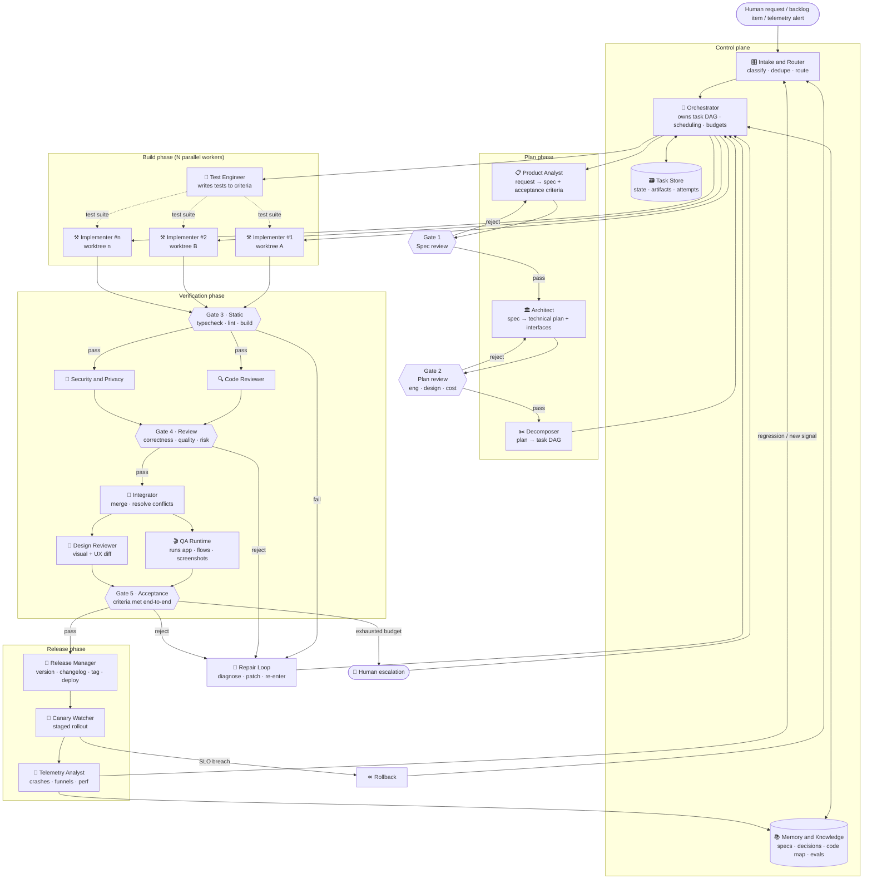
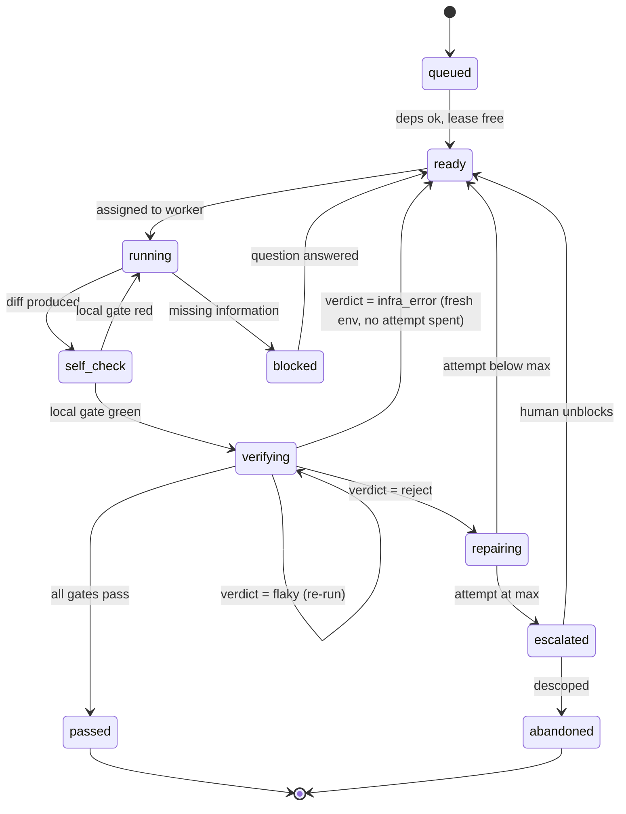
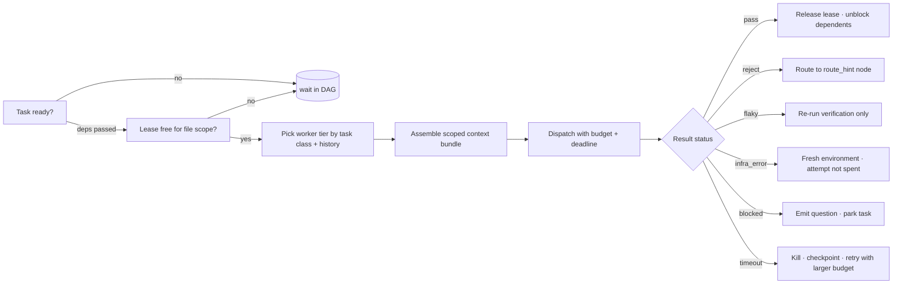
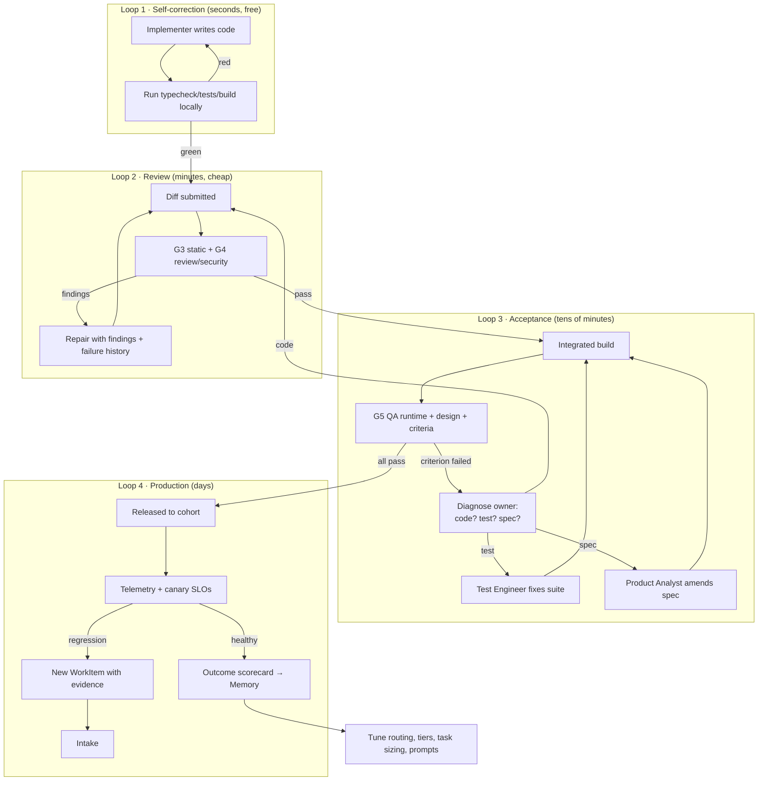

# Multi-Agent AI System for App Development

A reference architecture for building and shipping application features with a
team of specialised AI agents. It defines every agent's role, inputs, outputs
and decision logic; how work is routed; how it is validated through feedback
loops until completion; and how the whole thing behaves under failure, cost
pressure and load.

The design is deliberately implementable: every box maps onto something that
exists today (a subagent with a tool allowlist, a queue, a git worktree, a CI
job, a database row).

---

## 1. Design principles

| # | Principle | Consequence in the design |
|---|-----------|---------------------------|
| 1 | **Artifacts, not chat** | Agents exchange typed records (spec, plan, diff, report) stored in a task store. Conversation is an implementation detail; the artifact is the contract. |
| 2 | **Every hand-off is validated** | No output moves forward without passing a gate. Gates are ordered cheapest-first. |
| 3 | **Machine truth beats model opinion** | A compiler, a test runner, or a screenshot outranks any agent's judgement. Model critique is used only where no deterministic check exists. |
| 4 | **Bounded loops** | Every feedback loop has a max iteration count, a progress test, and an escalation target. Nothing retries forever. |
| 5 | **Stateless workers, stateful store** | Agents hold no durable state. All state lives in the task store + repo, so any worker can be killed and replaced. |
| 6 | **Isolation by default** | Each implementer works in its own git worktree/branch. Merge conflicts are resolved at integration, not by locking humans out. |
| 7 | **Escalate, don't stall** | When an agent cannot make progress, it produces a *blocked* record with a specific question rather than guessing or looping. |

---

## 2. System topology



**Reading the diagram.** Work enters at Intake, is planned, fanned out to
parallel implementers, then squeezed through five gates of increasing cost.
Any gate failure routes to the Repair Loop, which re-enters the DAG at the
cheapest node that can fix the problem — not necessarily back at the start.
Production telemetry closes the outermost loop by filing new work.

---

## 3. Agent roster

| Agent | Class | Model tier | Tools | Concurrency |
|-------|-------|-----------|-------|-------------|
| Intake & Router | control | small | task store, dedupe index | 1 (singleton) |
| Orchestrator | control | medium | task store, scheduler, budget ledger | 1 per project |
| Memory & Knowledge | service | small + embeddings | vector store, repo index | 1 |
| Product Analyst | plan | large | repo read, memory, web | 1 per feature |
| Architect | plan | large | repo read, memory, docs fetch | 1 per feature |
| Decomposer | plan | medium | repo read, dependency graph | 1 per feature |
| Implementer | build | large | full read/write, shell, worktree | N (elastic) |
| Test Engineer | build | medium | read/write tests, test runner | N |
| Code Reviewer | verify | large | read-only diff, repo read | N |
| Security & Privacy | verify | medium | read-only diff, dependency audit | N |
| Integrator | verify | medium | git, build | 1 per target branch |
| QA Runtime | verify | medium + vision | emulator/browser, screenshots | N (device-bound) |
| Design Reviewer | verify | large + vision | screenshots, design tokens | N |
| Release Manager | ship | medium | version files, changelog, CI, store API | 1 per target branch |
| Canary Watcher | ship | small | metrics API, feature flags | 1 per release |
| Telemetry Analyst | ship | medium | metrics, crash logs, session replays | 1 |

"Model tier" is a *starting* assignment; §10 describes how it is tuned from
outcome data rather than fixed by intuition.

---

## 4. Agent specifications

Each spec follows the same shape: **Role → Inputs → Outputs → Design logic →
Failure modes**. `→` outputs are the typed artifacts stored in the task store.

### 4.1 Intake & Router

- **Role.** The single front door. Normalises anything that arrives — human
  request, backlog item, telemetry alert, failed release — into a `WorkItem`,
  and decides where it goes.
- **Inputs.** Raw request text; source metadata; open-item index; repo
  capability map.
- **Outputs.** `WorkItem{id, title, intent, severity, affected_areas[],
  duplicate_of?, route}`.
- **Design logic.**
  1. **Classify intent** into one of: `feature`, `bug`, `refactor`, `chore`,
     `question`, `incident`. Classification uses a fixed label set so routing
     stays deterministic.
  2. **Dedupe** by embedding similarity against open items (cosine ≥ 0.92 →
     merge as a comment, not a new item).
  3. **Route by intent × severity:**
     - `question` → answered directly from Memory, no DAG created.
     - `bug` + severity ≥ high → hotfix lane, skips Product Analyst, enters at
       Architect with a reproduction requirement.
     - `incident` → rollback path first, root cause second.
     - everything else → full plan phase.
  4. **Reject** items with no testable outcome, returning a specific question.
- **Failure modes.** Ambiguous intent → route to `question` and ask, never
  guess into `feature`. Dedupe false-positive → the merged item keeps a
  back-reference so it can be split.

### 4.2 Orchestrator

- **Role.** Owns the task DAG for every in-flight work item: what is ready,
  what is running, what it costs, what happens on failure.
- **Inputs.** `WorkItem`s; task DAGs from the Decomposer; agent result records;
  budget ledger; worker pool state.
- **Outputs.** `TaskAssignment{task_id, agent, context_bundle, budget,
  deadline}`; DAG state transitions; `EscalationRequest` when budgets are spent.
- **Design logic.**
  1. **Readiness.** A task is dispatchable when all DAG predecessors are
     `passed` and its file-scope lease is free.
  2. **Scheduling.** Priority = `severity × blast_radius ÷ estimated_cost`,
     with aging so nothing starves. Critical-path tasks pre-empt leaf tasks.
  3. **Leases.** Each task declares a file/module scope. The Orchestrator
     grants a lease per scope; overlapping scopes are serialised, disjoint ones
     run in parallel. This is what makes N implementers safe.
  4. **Budgets.** Every work item carries a token, wall-clock and attempt
     budget. The Orchestrator decrements on each result and enforces §9's
     escalation ladder when a budget hits zero.
  5. **Context assembly.** It never forwards raw transcripts. For each
     assignment it builds a *context bundle*: spec slice, interface contracts,
     the 3–10 files in scope, prior failure reports for that task, and relevant
     memory entries. Context is scoped to the task, not the project.
- **Failure modes.** Deadlock between leases → detected by wait-for cycle
  check, broken by aborting the youngest task. Orchestrator crash → DAG is in
  the store, so a fresh instance resumes from persisted state.

### 4.3 Memory & Knowledge

- **Role.** The project's long-term memory, so agents stop rediscovering the
  same facts.
- **Inputs.** Merged specs, architecture decisions, review findings, incident
  post-mortems, code map, eval results.
- **Outputs.** Retrieval responses (`MemoryHit[]` with provenance);
  `CodeMap` (module → responsibility → owner tests); `DecisionRecord`s.
- **Design logic.** Three stores with different lifetimes: **durable**
  (architecture decisions, conventions, domain rules), **project**
  (current code map, open interfaces, recent diffs), **episodic** (what was
  tried on this work item and why it failed). Episodic memory is what stops a
  repair loop repeating an attempt. Retrieval is hybrid — lexical for
  identifiers, embedding for concepts — and every hit carries a source path so
  downstream agents can verify rather than trust.
- **Failure modes.** Stale memory is worse than none: entries are invalidated
  when the files they cite change, and any hit older than its file's mtime is
  returned flagged `stale`.

### 4.4 Product Analyst

- **Role.** Turn a request into a specification with acceptance criteria that a
  machine can check.
- **Inputs.** `WorkItem`; current app behaviour (from repo + Memory); user
  telemetry for the affected area.
- **Outputs.** `Spec{problem, users, scope[], out_of_scope[],
  acceptance_criteria[], edge_cases[], open_questions[]}`.
- **Design logic.** Each acceptance criterion must be written as an observable
  behaviour with a verification method attached — `unit`, `integration`,
  `runtime`, or `visual`. A criterion with no verification method is not a
  criterion; it is moved to `open_questions`. The analyst explicitly writes
  `out_of_scope` to prevent downstream scope drift, and never invents product
  decisions: unresolved choices become questions on the item, and the item can
  still proceed if the questions do not block the core scope.
- **Failure modes.** Over-specification (designing the solution) is caught at
  Gate 1. Under-specification shows up as Gate 5 ambiguity and is fed back as a
  spec defect, not an implementation defect.

### 4.5 Architect

- **Role.** Decide *how*, before anyone writes code.
- **Inputs.** `Spec`; code map; existing interfaces; framework/version docs
  (fetched live — never recalled from training).
- **Outputs.** `Plan{approach, alternatives_considered[], interfaces[],
  data_model_changes[], file_touchpoints[], migration, risks[],
  perf_budget, rollout}`.
- **Design logic.**
  1. Read the real code and the *versioned* docs for the exact framework
     release in use before proposing anything.
  2. Produce at least two candidate approaches with an explicit trade-off on
     complexity, blast radius and reversibility; choose the most reversible
     one that meets the criteria.
  3. Define **interfaces first** (types, props, storage shape, API contracts).
     These become the seams along which the Decomposer can parallelise.
  4. Declare the perf/size budget the implementation must not exceed.
- **Failure modes.** Plans that touch more than a threshold of modules are
  returned for splitting — large blast radius is treated as a design smell, not
  a scheduling problem.

### 4.6 Decomposer

- **Role.** Convert the plan into the smallest independently verifiable tasks
  and wire their dependencies.
- **Inputs.** `Plan`; code map; historical task-size statistics.
- **Outputs.** `TaskDAG{nodes: Task[], edges}` where
  `Task{id, goal, file_scope[], interface_contract, acceptance_slice[],
  verification, est_cost, deps[]}`.
- **Design logic.** Split along interface boundaries so each task can be
  verified alone. Target task size is calibrated from history — the size band
  where first-pass gate success has been highest — rather than a fixed rule.
  Anything above the band is split; trivia below it is merged to avoid
  orchestration overhead exceeding the work. Every task inherits a *slice* of
  the acceptance criteria, so nothing is verified only at the end. Tasks that
  must share a file scope are explicitly sequenced.
- **Failure modes.** A DAG with a cycle, an orphan criterion, or a task with no
  verification method fails structural validation and is regenerated.

### 4.7 Implementer (elastic pool)

- **Role.** Write the code for exactly one task.
- **Inputs.** `TaskAssignment` context bundle; interface contract; acceptance
  slice; prior `FailureReport`s for this task.
- **Outputs.** `Diff` (branch/worktree ref); `ImplNote{decisions,
  deviations, follow_ups}`; self-check results.
- **Design logic.**
  1. Work only inside the declared file scope. Needing to touch anything else
     is a signal, reported as a scope-extension request rather than taken
     silently.
  2. Reproduce before repairing: on a bug task, write the failing test first.
  3. Run the local gate (typecheck + affected tests + build) *before*
     submitting. Submitting known-red work is the single biggest waste in the
     pipeline.
  4. On a repair assignment, read the episodic memory of prior attempts and
     state explicitly what it is doing differently. If it cannot state a
     difference, it escalates instead of retrying.
  5. Never weaken a test to make it pass; that path is blocked at review and
     wastes a whole cycle.
- **Failure modes.** Runaway edits (diff exceeds scope × factor) trip a
  circuit breaker and the worktree is discarded. Sandbox violations (network,
  secrets, out-of-repo writes) abort the task immediately.

### 4.8 Test Engineer

- **Role.** Own the executable definition of "done".
- **Inputs.** `Spec` acceptance criteria; task acceptance slices; existing
  suite; coverage of the affected modules.
- **Outputs.** `TestSuiteDiff`; `CoverageReport`; `TestGapReport`.
- **Design logic.** Writes tests **from the criteria, not from the
  implementation**, and ideally before or in parallel with it, so the tests are
  an independent check rather than a transcription of whatever the implementer
  did. Prioritises edge cases named in the spec, then boundary and error paths.
  Flags criteria that cannot be tested at the current layer and asks for a seam
  instead of asserting on internals.
- **Failure modes.** Flaky tests are quarantined automatically after repeat
  non-deterministic results and filed as their own work item — a flaky suite
  destroys the trustworthiness of every gate downstream.

### 4.9 Code Reviewer

- **Role.** Catch what compilers and tests cannot.
- **Inputs.** `Diff`; `Task` goal and scope; conventions from Memory; the
  spec slice.
- **Outputs.** `ReviewReport{findings: [{severity, file, line, claim,
  failure_scenario, suggested_fix}], verdict}`.
- **Design logic.** Reviews the diff, not the whole repo, but reads enough
  surrounding code to judge correctness in context. Each finding must include a
  concrete failure scenario — inputs/state → wrong result. Findings that cannot
  be stated that way are downgraded to suggestions and do not block. Severity
  ladder: `blocker` (wrong behaviour, data loss, security), `major` (missing
  edge case, silent failure), `minor` (clarity, duplication). Only `blocker`
  and `major` fail Gate 4. Reviewer is deliberately a *different* model
  instance with no access to the implementer's reasoning, so it cannot inherit
  its blind spots.
- **Failure modes.** Review theatre (many trivial findings) is detected by
  tracking finding severity distribution per reviewer over time and re-tuning
  its prompt or tier.

### 4.10 Security & Privacy

- **Role.** Risk gate for anything touching data, auth, storage, network or
  dependencies.
- **Inputs.** `Diff`; dependency manifest changes; data-flow map; permission
  and entitlement declarations.
- **Outputs.** `SecurityReport{findings[], data_flows_changed[], verdict}`.
- **Design logic.** Runs unconditionally on diffs matching risk patterns
  (auth, crypto, storage, IPC, file/network I/O, permissions, new deps) and is
  skipped for pure-UI diffs to save budget. Checks: secret material in code or
  logs, unencrypted sensitive storage, over-broad permissions, injection sinks,
  new dependency provenance and licence, PII crossing a process or network
  boundary. Any finding at `blocker` fails Gate 4 regardless of other verdicts.
- **Failure modes.** Alert fatigue is managed by suppressing findings the
  project has explicitly accepted, recorded as dated decisions in Memory with
  an expiry.

### 4.11 Integrator

- **Role.** Turn N parallel worktrees into one coherent branch.
- **Inputs.** Approved `Diff`s; target branch; lease map.
- **Outputs.** `IntegrationResult{merged_sha, conflicts_resolved[],
  build_status}`; `ConflictReport` on failure.
- **Design logic.** Merges in dependency order. Resolves mechanical conflicts
  itself; semantic conflicts — both sides changing the same behaviour — are
  never guessed, they are returned to the two owning tasks with both intents
  quoted. After every merge it re-runs the static gate on the *combined* tree,
  because two individually green diffs can be jointly red. Keeps the target
  branch always-green: a merge that breaks it is reverted, not fixed forward.
- **Failure modes.** Merge storms under high parallelism are handled by merge
  batching (§10) and by shrinking the parallel window when the conflict rate
  crosses a threshold.

### 4.12 QA Runtime

- **Role.** Prove the software actually works when run, not just when compiled.
- **Inputs.** Integrated build; acceptance criteria with `runtime` verification;
  device/emulator or browser; seeded fixtures.
- **Outputs.** `QAReport{criterion → pass/fail, repro_steps, logs,
  screenshots[], perf_samples}`.
- **Design logic.** Boots the real app, drives the real flows, and asserts on
  observable state. Every failure must come with deterministic reproduction
  steps — a failure QA cannot reproduce is reported as `flaky`, not `failed`,
  and routed to the flake lane instead of the repair loop. Captures
  screenshots at each criterion checkpoint for the Design Reviewer, plus
  cold-start, frame-time and memory samples against the plan's perf budget.
- **Failure modes.** Environment failures (emulator dead, network flaky) are
  classified as *infrastructure*, not *product*, and retried on a fresh
  environment without consuming the task's attempt budget.

### 4.13 Design Reviewer

- **Role.** Judge the interface a human will actually look at.
- **Inputs.** QA screenshots (before/after); design tokens; platform
  conventions; accessibility requirements.
- **Outputs.** `DesignReport{visual_diffs[], findings[], verdict}`.
- **Design logic.** Compares against the token system rather than taste:
  spacing scale, type scale, contrast ratios, touch-target size, state coverage
  (empty/loading/error/long-content), dark-mode parity, and layout at the
  narrowest and widest supported widths. Blocks only on measurable violations
  (contrast below threshold, target below minimum, missing state, overflow);
  everything else is advisory so subjective taste never deadlocks a release.
- **Failure modes.** Screenshot drift across devices is handled by pinning a
  reference device set and comparing per-device baselines.

### 4.14 Release Manager

- **Role.** Ship it, and make the change legible to humans.
- **Inputs.** Green integrated branch; Gate 5 pass; version files; changelog;
  release-note history.
- **Outputs.** Version bump commit, `CHANGELOG` entry, user-facing release
  notes, tag, build, deploy request.
- **Design logic.** Applies the project's versioning rule mechanically (bump
  size derived from the class and count of merged work items), keeps derived
  fields consistent (app version, platform version codes, package version),
  and writes two descriptions of the change: one for engineers, one in user
  language. It refuses to release if any derived version field disagrees, if
  the changelog entry is missing, or if the branch is not green at the exact
  SHA being tagged.
- **Failure modes.** Partial releases (tag pushed, build failed) are made
  idempotent: the release record is written first as `pending`, and a retry
  resumes from the last completed step rather than re-tagging.

### 4.15 Canary Watcher

- **Role.** Guard the blast radius of a live release.
- **Inputs.** Release record; rollout cohorts; SLO definitions; live metrics.
- **Outputs.** `RolloutDecision{advance | hold | rollback}`; incident record.
- **Design logic.** Staged exposure (e.g. 1% → 10% → 50% → 100%), each stage
  held for a minimum observation window sized so the metric has statistical
  power. Compares cohort vs. control on crash-free rate, error rate, key
  funnel conversion and startup time. Any SLO breach triggers automatic
  rollback (or flag-off) first and diagnosis second, and files an `incident`
  WorkItem at Intake with the metric evidence attached.
- **Failure modes.** Low-traffic cohorts give underpowered signals; the watcher
  reports `insufficient_signal` and extends the window rather than declaring
  success.

### 4.16 Telemetry Analyst

- **Role.** Close the outermost loop — turn what real users do into the next
  backlog.
- **Inputs.** Crash clusters, error logs, funnels, performance traces, store
  reviews, support tickets.
- **Outputs.** `WorkItem`s (bugs, regressions, opportunities) with evidence;
  Memory updates on real-world behaviour; per-feature outcome scorecards.
- **Design logic.** Clusters raw events into distinct problems, ranks by
  `users_affected × severity ÷ estimated_fix_cost`, and — critically — links
  each item back to the release and work item that introduced it. That link is
  what makes the system able to learn which planning and review decisions
  actually correlate with defects (§10).
- **Failure modes.** Correlation ≠ causation: items are filed with confidence
  levels, and low-confidence items enter as investigations rather than fixes.

---

## 5. The shared contract

Every message on the bus is the same envelope. This is what makes agents
swappable and the pipeline resumable.

```jsonc
{
  "envelope": {
    "msg_id": "uuid",
    "work_item": "WI-4127",
    "task": "T-4127-03",
    "from": "implementer",
    "to": "orchestrator",
    "attempt": 2,
    "parent_msg": "uuid",
    "budget_used": { "tokens": 41200, "seconds": 96, "usd": 0.38 }
  },
  "artifact": {
    "type": "Diff",                 // Spec | Plan | TaskDAG | Diff | *Report
    "schema_version": "1.2",
    "ref": "worktree://wt-03@a1b2c3d",
    "summary": "Adds recurring-budget rollover to the ledger reducer",
    "self_check": { "typecheck": "pass", "tests": "pass", "build": "pass" }
  },
  "verdict": {                       // present on verification artifacts
    "status": "reject",              // pass | reject | blocked | flaky | infra_error
    "findings": [ /* severity, file, line, claim, failure_scenario, fix */ ],
    "route_hint": "implementer"      // cheapest node that can fix this
  }
}
```

Three fields carry most of the system's intelligence:

- **`status`** distinguishes *product failure* (`reject`) from *non-determinism*
  (`flaky`) from *environment failure* (`infra_error`) from *missing
  information* (`blocked`). Conflating these is the most common way real
  pipelines burn budget: infra errors get "fixed" by editing correct code.
- **`route_hint`** lets a verifier name the cheapest node that can repair the
  problem, so a failing acceptance criterion caused by a bad spec goes back to
  the Product Analyst, not around another implementation lap.
- **`attempt`** drives the escalation ladder in §9.

**Task state machine** — every task in the store moves through exactly these
states, which is what allows a crashed run to resume:



---

## 6. Routing logic

Routing happens at three levels.

**Level 1 — intent routing (Intake).** Classify, dedupe, pick the lane:
full-plan, hotfix, incident, or answer-only. Lane choice determines which
plan-phase agents run at all.

**Level 2 — dependency routing (Orchestrator).** Dispatch by DAG readiness and
lease availability:



**Level 3 — capability routing (per task).** Which *kind* of agent, at which
model tier, gets the task:

| Task signal | Route to | Tier |
|---|---|---|
| Touches interfaces/data model | Architect first, then Implementer | large |
| Single-file, well-specified, has tests | Implementer directly | medium |
| Mechanical (rename, codemod, config) | Implementer with a script-first instruction | small |
| Diff touches auth/storage/deps/network | + Security & Privacy | medium |
| Diff touches rendered UI | + QA Runtime + Design Reviewer | vision |
| Repeated failure on same task (attempt ≥ 2) | Implementer at a higher tier + full failure history | large |
| Cross-cutting change > blast-radius threshold | Back to Decomposer to split | medium |

The rule that matters most: **failures escalate tier, successes de-escalate
it.** A task class that has passed first-time in the last N runs gets tried at
a cheaper tier next time; two consecutive failures move it up permanently until
it earns its way back down.

---

## 7. Validation gates

Gates are ordered so the cheapest, most objective check runs first. Nothing
expensive ever runs on work that a compiler could have rejected.

| Gate | Runs after | Checks | Verifier | Cost | Fail routes to |
|------|-----------|--------|----------|------|----------------|
| **G0 Self-check** | every implementer | typecheck, affected tests, build | deterministic | ~free | same implementer, no attempt spent |
| **G1 Spec review** | Product Analyst | criteria testable, scope bounded, no solutioning | Architect + Reviewer | low | Product Analyst |
| **G2 Plan review** | Architect | feasibility, interfaces defined, blast radius, cost, alternatives | Reviewer + Security triage + Design triage | low | Architect |
| **G3 Static** | every diff | typecheck, lint, full unit suite, bundle/build, size budget | deterministic | low | Implementer |
| **G4 Review** | G3 pass | correctness findings, security findings, convention adherence | Code Reviewer + Security | medium | Implementer (or Architect if design-level) |
| **G5 Acceptance** | integration | every acceptance criterion verified end-to-end, perf budget, visual/a11y checks | QA Runtime + Design Reviewer | high | route_hint: Implementer / Test Engineer / Analyst |
| **G6 Production** | release | SLOs on canary cohort | Canary Watcher | live | Rollback + new WorkItem |

**Definition of done** — a work item completes only when: every acceptance
criterion has a `pass` from its declared verification method; G3–G5 are green
on the integrated SHA at the released commit; no `blocker` or `major` finding
is open; version, changelog and release notes exist; and the canary has
advanced to 100% without an SLO breach. Anything less is `partially_complete`
with the gap stated explicitly — never rounded up to done.

---

## 8. Feedback loops

Four nested loops, fastest and cheapest on the inside.



**Loop control** — the rules that keep loops from becoming infinite:

1. **Attempt ceiling.** Loop 2: 3 attempts. Loop 3: 2 attempts per criterion.
   Loop 4: 1 automatic rollback, then human.
2. **Progress test.** Each iteration must reduce the failing-check set or add
   new information. Two iterations with an identical failure signature is
   defined as *no progress* and short-circuits the ceiling.
3. **Oscillation detection.** Hash each diff; a repeat hash, or an A→B→A
   alternation across attempts, aborts the loop immediately and escalates —
   this is the classic way agent pipelines burn a day going nowhere.
4. **Diversity on retry.** Attempt 2 gets the full failure history and a higher
   tier. Attempt 3 changes strategy: a different decomposition, or two
   implementers racing independently with the reviewer picking the winner.
5. **Owner diagnosis before repair.** In Loop 3 the failure is first attributed
   to code, test, or spec. Repairing code for a spec defect is the most
   expensive mistake in the system, and it is prevented by making attribution
   an explicit, separately-recorded step.

---

## 9. Failure handling

**Taxonomy.** Every failure is classified before it is acted on, because each
class has a different correct response:

| Class | Example | Response | Consumes attempt? |
|---|---|---|---|
| `product_defect` | Wrong behaviour, failing criterion | Repair loop | yes |
| `spec_defect` | Criterion unverifiable or contradictory | Back to Analyst | no (charged to plan phase) |
| `flaky` | Non-deterministic test/QA result | Re-run ×2; quarantine + file item if it persists | no |
| `infra_error` | Emulator crash, network, rate limit | Retry on fresh env with backoff | no |
| `budget_exhausted` | Tokens/time/attempts spent | Escalation ladder | terminal |
| `blocked` | Missing decision or credential | Park with a specific question | no |
| `poison_task` | Repeatedly fails every strategy | Quarantine, descope, human review | terminal |
| `sandbox_violation` | Out-of-scope write, secret exfil attempt | Hard abort, discard worktree, alert | terminal |

**Escalation ladder.** Applied in order as attempts accumulate:

1. Retry, same agent, with the failure report attached.
2. Retry at a higher model tier, with full episodic history and an explicit
   "state what you are doing differently" requirement.
3. Re-decompose: the Decomposer splits the task into smaller verifiable pieces.
4. Re-architect: the failure is treated as evidence the plan was wrong.
5. Human escalation with a decision-ready summary: what was attempted, what
   each attempt produced, the specific question, and the two or three options
   with trade-offs.
6. Descope: the item is marked `partially_complete`, the gap is documented,
   and the rest of the release proceeds. **Silence is never an option** — an
   unshipped criterion is always reported.

**Structural safeguards.**

- **Checkpointing.** Task state and worktree SHA are persisted after every
  transition; a killed worker loses at most one task-attempt.
- **Idempotency.** Every side-effecting action (merge, tag, deploy, store
  submission) is keyed by `(work_item, step)` so a retry resumes rather than
  duplicates.
- **Circuit breakers.** Per-agent error-rate and per-project spend breakers.
  When a breaker opens, that agent class is paused, in-flight work is
  checkpointed, and the Orchestrator reports rather than thrashing.
- **Blast-radius caps.** A diff exceeding its declared scope by a set factor is
  auto-rejected before review — cheaper to regenerate than to review.
- **Always-green trunk.** The integration branch is protected by G3; a merge
  that reddens it is reverted immediately, so failures never compound.
- **Rollback path.** Every release is behind a flag or a staged rollout, so the
  recovery action is always available and fast.
- **Sandboxing.** Implementers run with a filesystem scope, no credential
  access beyond what the task declares, and network egress restricted to an
  allowlist. Violations are terminal, not retryable.

---

## 10. Optimization

**Cost and latency.**

1. **Gate ordering.** Deterministic checks before model checks, always. A
   typecheck costs a cent and catches what a review would have spent a dollar
   finding.
2. **Context minimisation.** Scoped bundles, not transcripts. Context size is
   the dominant cost term, and oversized context measurably *reduces* accuracy
   as well as raising price.
3. **Prompt/prefix caching.** Stable system prompts, conventions and code-map
   sections are placed at the front of every bundle so they cache across the
   whole run; volatile task content goes last.
4. **Model tiering with feedback.** Start with §3's tiers, then let outcomes
   move them: track first-pass gate success by (task class × tier) and
   automatically demote classes that succeed cheaply, promote those that don't.
5. **Speculative parallelism.** While review runs on a diff, the next
   independent task starts. On high-uncertainty tasks, race two implementers
   with different strategies and keep the one that passes gates first — worth
   it exactly when the expected retry cost exceeds the duplicate cost.
6. **Merge batching.** Integrate in batches when the conflict rate is low;
   shrink the batch automatically when it rises.
7. **Incremental verification.** Run affected tests at G3 and the full suite
   only at integration; run QA only on criteria whose code paths changed.
8. **Result caching.** Key gate results by `(diff_hash, gate, toolchain_hash)`
   so re-verification after an unrelated rebase is free.

**Quality.**

9. **Eval harness.** A frozen set of past work items with known-good outcomes.
   Any prompt, tier or routing change is replayed against it and must not
   regress first-pass rate, escaped-defect rate or cost per item.
10. **Escaped-defect attribution.** Every production bug is traced to the gate
    that should have caught it; that gate's checklist gains a case. This is the
    single highest-leverage loop in the system — it makes the pipeline
    monotonically better instead of merely busy.
11. **Task-size calibration.** Recompute the optimal task-size band from
    first-pass success data monthly and feed it back to the Decomposer.
12. **Reviewer calibration.** Track precision (findings that turn out real) per
    reviewer configuration; retune the ones that drift into noise.

**Metrics and SLOs.**

| Metric | Definition | Target direction |
|---|---|---|
| First-pass gate rate | Tasks passing G3+G4 without repair | ↑ |
| Repair depth | Mean loop-2 iterations per task | ↓ |
| Escaped defects | Bugs found after G5, per release | ↓ |
| Cycle time | Intake → released, p50 and p90 | ↓ |
| Cost per shipped item | Total spend ÷ items merged | ↓ |
| Human touches | Escalations per 100 tasks | ↓ (but never 0) |
| Rollback rate | Releases rolled back ÷ releases | ↓ |
| Flake rate | Non-deterministic verdicts ÷ verdicts | ↓ |

---

## 11. Scalability

**Horizontal.** Implementers, reviewers, testers and QA agents are stateless
consumers of a work queue; scale is a matter of adding consumers. All
coordination state is in the task store, so workers can be pre-empted freely.

**Concurrency safety.** The lease system (§4.2) is the mechanism that lets
parallelism grow without merge chaos: disjoint file scopes run in parallel,
overlapping scopes serialise. Practical ceiling is set by the conflict rate,
which the Orchestrator monitors and uses to auto-tune the parallel window.

**Isolation.** One git worktree per implementer, one ephemeral environment per
QA run. Nothing shares mutable state except through the integration branch.

**Sharding for large codebases.** Partition by module with a designated
interface contract between shards. Each shard gets its own Orchestrator,
worker pool and integration branch; a thin cross-shard coordinator handles only
interface-level changes. This keeps DAG size and code-map retrieval bounded as
the repo grows.

**Backpressure.** Queue depth, spend rate and conflict rate all feed admission
control. When any crosses its threshold the Intake agent stops admitting new
work items (existing ones still drain), which prevents the pathological state
where everything is in flight and nothing completes.

**Device- and rate-bound resources.** QA emulators, store APIs and vendor rate
limits are modelled as finite resource pools with fair queueing, so a burst of
UI work cannot starve the pipeline of verification capacity.

**Multi-project.** The control plane is per-project, the worker pool is shared.
Memory is namespaced per project with an optional shared layer for
organisation-wide conventions.

**Capacity sketch** — with `W` implementers, mean task time `t`, first-pass
rate `p`, and mean repair depth `d`, effective throughput is roughly
`W ÷ (t × (1 + d(1−p)))`. It shows where investment pays: raising `p` (better
specs, tighter tasks, self-check discipline) beats adding workers, because
adding workers scales the numerator linearly while repair depth multiplies the
denominator.

---

## 12. Real-world implementation

**Mapping onto today's tooling.**

| Component | Concrete implementation |
|---|---|
| Agents | Subagents with per-role tool allowlists and system prompts |
| Task store | Postgres (tasks, attempts, artifacts, leases) or the issue tracker for small teams |
| Queue | Any durable queue with visibility timeouts and DLQ |
| Isolation | `git worktree` per implementer; container per QA run |
| Gates G3 | Existing CI: typecheck, lint, test, build |
| Gates G4 | Review subagents invoked on the PR diff |
| Gates G5 | Emulator/browser automation + screenshot capture |
| Memory | Repo docs + a vector index over specs, decisions and post-mortems |
| Release | Existing release pipeline, driven by the Release Manager agent |
| Escalation | PR comment or chat message with the decision-ready summary |

**Rollout in three stages** — do not build §2 in one go; each stage is useful
alone and earns the next.

- **v0 (week 1).** Analyst → Implementer → G3 → Reviewer → human merge. One
  worker, no parallelism. This alone captures most of the value, because G3
  plus an independent reviewer catches the majority of defects.
- **v1 (weeks 2–4).** Add Decomposer + 3–5 parallel implementers with leases,
  Test Engineer, Security gate, and the Orchestrator's budget/attempt ceilings.
  Add the escalation ladder and the eval harness — the harness before any
  further tuning, so improvements are measurable rather than believed.
- **v2 (quarter).** Add QA Runtime, Design Reviewer, Release Manager, Canary
  Watcher and Telemetry Analyst to close Loop 4, then turn on the optimization
  feedback (tier tuning, task-size calibration, escaped-defect attribution).

**Three things that decide whether this works in practice.** Acceptance
criteria that a machine can check — everything downstream is built on them.
Honest failure classification, so infra flakes never get "fixed" by editing
correct code. And bounded loops with a real escalation path, so the system
degrades into asking a human rather than into spending a budget in silence.
